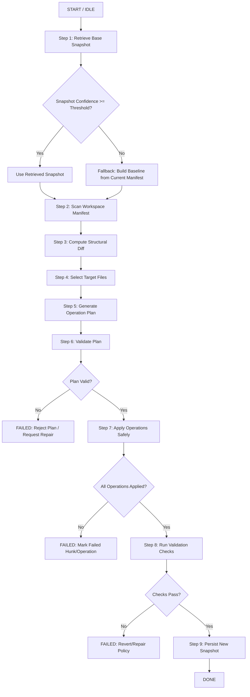

# AlgoTodo: Self-Monitoring Workspace Update Algorith
## Goal
Build a workspace-aware update system that:
- Tracks prior workspace state and prompt history.
- Reuses old state for new prompts.
- Applies minimal changes to files (line-level where possible).
- Avoids full rewrites unless explicitly required.

---

## Core Principles
1. Keep workspace structure state separate from file content state.
2. Plan changes as operations (add/remove/patch), not full generation.
3. Compare old vs current state before deciding modifications.
4. Apply safe patches with context checks.
5. Persist new snapshot after successful updates.

---

## Data Model

### 1) Workspace Snapshot
Stores structure and file metadata for a point in time.

Fields:
- snapshot_id: unique id
- prompt: user prompt that produced this snapshot
- timestamp: creation/update time
- root_folders: list of top-level folders
- file_manifest: map[path] -> { hash, size, modified_at, language }
- summary: optional natural language summary

### 2) File Version Record
Stores per-file content and semantics.

Fields:
- snapshot_id
- path
- content_hash
- content
- symbols: optional function/class names
- embedding: optional vector for semantic retrieval

### 3) Change Plan Record
Stores intended operations for an update request.

Fields:
- request_id
- snapshot_base_id
- prompt
- operations: list of operation objects
- validation_status

---

## Storage Strategy (Qdrant + Disk)

Use one shared Qdrant client with multiple collections:
- docs: source document chunks
- workspace_structures: stored workspace snapshots/prompts
- file_versions: file-level records (optional)
- patch_history: applied patch metadata (optional)

Use disk as execution source-of-truth for actual file writes.

---

## Operation Contract (LLM Output)

The model should return only explicit operations:

1. mkdir
- path

2. add_file
- path
- content

3. remove_file
- path

4. patch_file
- path
- hunks: list of
  - before_context
  - remove_lines
  - add_lines

5. move_file (optional)
- from_path
- to_path

Notes:
- Prefer patch_file for existing files.
- Use add_file only for new files.
- Use remove_file only when explicitly justified by prompt.

---

## End-to-End Algorithm

## Block Diagram



### Step 1: Retrieve Base Snapshot
- Retrieve best previous snapshot by prompt similarity.
- If no reliable match, initialize a new baseline from current disk scan.

### Step 2: Build Current Manifest
- Traverse workspace.
- Compute file hash and metadata.
- Build current file_manifest.

### Step 3: Compute Structural Diff
Compare base snapshot vs current manifest:
- added_paths
- removed_paths
- modified_paths
- unchanged_paths

### Step 4: Select Target Files
- Use prompt + semantic retrieval + symbol hints.
- Restrict edit set to relevant files only.

### Step 5: Generate Change Plan
- Provide model with:
  - prompt
  - base summary
  - selected file contents
  - diff context
- Request operation contract output only.

### Step 6: Validate Plan
- Reject dangerous or broad rewrites unless requested.
- Ensure paths are inside workspace.
- Ensure patch hunks include enough context.

### Step 7: Apply Operations Safely
Execution order:
1. mkdir
2. add_file
3. patch_file
4. remove_file
5. move_file

For each patch hunk:
- Match before_context in current file.
- Apply only exact or near-exact contextual match.
- If not matched, mark hunk as failed and continue or stop per policy.

### Step 8: Validate Build/Checks
- Run syntax/lint/tests/build as applicable.
- If failed, revert failed operation group or request a repair plan.

### Step 9: Persist New Snapshot
- Save updated workspace snapshot and changed file versions.
- Store prompt and operation history for future retrieval.

---

## Minimal-Change Policy

To avoid rewriting all files:
- Skip unchanged files by hash.
- Never regenerate file content if only a few lines are needed.
- Prefer patch_file with small hunks.
- Require explicit reason for any full-file replacement.

---

## Confidence and Fallback Rules

1. Snapshot retrieval confidence
- If similarity below threshold, do not auto-reuse old structure blindly.
- Fall back to intent generation plus current manifest.

2. Patch confidence
- If hunk context does not match, avoid blind apply.
- Request revised patch from model with refreshed file context.

3. Structure confidence
- If retrieved structure is empty or malformed, ignore and regenerate.

---

## Suggested Runtime States

- IDLE
- LOAD_BASE_SNAPSHOT
- SCAN_WORKSPACE
- PLAN_CHANGES
- VALIDATE_PLAN
- APPLY_CHANGES
- RUN_VALIDATION
- SAVE_SNAPSHOT
- DONE
- FAILED

---

## Pseudocode

```python
def self_monitoring_update(user_prompt: str):
    base_snapshot = retrieve_snapshot_by_prompt(user_prompt)
    current_manifest = scan_workspace_manifest()

    diff = compare_manifests(base_snapshot.manifest if base_snapshot else {}, current_manifest)
    targets = select_target_files(user_prompt, diff)

    plan = llm_generate_operation_plan(
        prompt=user_prompt,
        base_snapshot=base_snapshot,
        current_manifest=current_manifest,
        target_files=load_files(targets),
    )

    validate_operation_plan(plan)

    apply_result = apply_operations(plan)
    check_result = run_checks()

    if not check_result.ok:
        handle_failure(apply_result, check_result)
        return {"status": "failed", "reason": check_result.reason}

    new_snapshot_id = persist_snapshot(user_prompt, scan_workspace_manifest(), plan)
    return {"status": "ok", "snapshot_id": new_snapshot_id}
```

---

## Implementation Checklist

1. Snapshot schema implemented.
2. Manifest scanner implemented.
3. Diff engine implemented.
4. Operation contract prompt implemented.
5. Safe patch applier implemented.
6. Validation pipeline integrated.
7. Snapshot persistence integrated.
8. Prompt-based retrieval threshold configured.

---

## Practical Notes for Current Project

- Keep shared Qdrant client, separate collections.
- Store request prompt in workspace snapshot metadata.
- Return tuple (structure, prompt_used) when retrieving previous structure.
- Prefer editing existing files via patch hunks over full content replacement.
- Log every applied operation for debugging and rollback.

---

## workspace_agent Function Hierarchy

This section maps the actual call flow implemented in workspace_agent.py.

```text
WorkspaceAgent.run(...)
  -> self_monitoring_update(...)
    -> retrieve_base_snapshot(...)
    -> scan_workspace_manifest(...)
      -> _iter_workspace_files(...)
        -> _is_ignored_dir(...)
      -> _hash_file(...)
      -> _guess_language(...)
    -> compare_manifests(...)
    -> select_target_files(...)
    -> planner(planning_context) or default_plan_builder(...)
    -> validate_operation_plan(...)
      -> _normalize_operation_type(...)
      -> _assert_path_in_workspace(...)
    -> apply_operations(...)
      -> _normalize_operation_type(...)
      -> _apply_single_operation(...)
        -> mkdir use case
          -> Path.mkdir(...)
        -> add_file use case
          -> Path.parent.mkdir(...)
          -> Path.write_text(...)
        -> remove_file use case
          -> Path.unlink(...)
        -> move_file use case
          -> Path.parent.mkdir(...)
          -> Path.replace(...)
        -> patch_file use case
          -> Path.read_text(...)
          -> _apply_patch_hunks(...)
          -> Path.write_text(...)
    -> checks(root) if provided
    -> scan_workspace_manifest(...)   [refresh manifest after apply]
      -> _iter_workspace_files(...)
      -> _hash_file(...)
      -> _guess_language(...)
    -> persist_snapshot(...)
      -> _now_iso(...)
      -> store_workspace_structure(...)
```

### Function Responsibility Matrix

| Function / Call | Task / Responsibility | Key Library Functions with Comments Added |
| --- | --- | --- |
| `WorkspaceAgent.run(...)` | Public entrypoint that triggers the complete workspace update workflow. | N/A |
| `self_monitoring_update(...)` | Main orchestrator for retrieval, scan, diff, planning, validation, apply, checks, and snapshot persistence. | `uuid4()` – generates unique request ID |
| `retrieve_base_snapshot(...)` | Retrieves the best previous workspace snapshot by prompt similarity threshold. | N/A |
| `scan_workspace_manifest(...)` | Scans the current workspace and builds the file manifest with hashes and metadata. | `.resolve()` – absolute path normalization; `.relative_to()` – relative path extraction; `.as_posix()` – portable path format; `.stat()` – file metadata retrieval; `.fromtimestamp()` – Unix timestamp conversion; `.isoformat()` – ISO 8601 formatting |
| `_iter_workspace_files(...)` | Walks the workspace tree and yields each relevant file path. | `.relative_to()`, `.as_posix()` – path normalization; `.startswith()`, `.endswith()` – path matching |
| `_is_ignored_dir(...)` | Filters out cache/generated/storage directories that should not be part of the manifest. | `.strip()` – whitespace removal; `.startswith()` – prefix matching |
| `_hash_file(...)` | Computes a stable SHA-256 hash for file content comparison. | `.open("rb")` – binary read mode for any file type; `hashlib.sha256()` – cryptographic hashing |
| `_guess_language(...)` | Infers file language from its extension for manifest metadata. | `.suffix.lower()` – file extension extraction and normalization |
| `compare_manifests(...)` | Computes added, removed, modified, and unchanged paths between baseline and current workspace. | `set()` – efficient membership and diff operations; `sorted()` – deterministic iteration order |
| `select_target_files(...)` | Chooses likely files to update using diff signals and semantic retrieval hits. | `set()` – union of diff signals and semantic hits; `.replace()` – path separator normalization |
| `planner(planning_context)` | Produces explicit file-system operations for the requested workspace update. | N/A |
| `default_plan_builder(...)` | Fallback planner that returns no operations when no planner is supplied. | N/A |
| `validate_operation_plan(...)` | Validates operation structure, allowed operation types, path safety, and patch hunk requirements. | `.resolve()` – absolute path resolution for boundary checking; `.parents` – ancestry path traversal |
| `_normalize_operation_type(...)` | Converts raw operation type values into the `OperationType` enum. | `isinstance()` – type checking; `OperationType()` – enum conversion |
| `_assert_path_in_workspace(...)` | Ensures an operation path stays inside the workspace root. | `.resolve()` – symlink resolution; `.parents` – path ancestry check |
| `apply_operations(...)` | Executes validated operations in a deterministic safe order. | `sorted()` – deterministic execution order; `.get()` – safe dict access |
| `_apply_single_operation(...)` | Dispatches one operation to its concrete file-system action. | `.mkdir(parents=True, exist_ok=True)` – recursive idempotent directory creation; `.parent` – parent directory extraction; `.write_text(encoding="utf-8")` – UTF-8 file writing; `.exists()`, `.is_file()` – safety checks; `.unlink()` – file deletion; `.replace()` – file rename/move; `.read_text(encoding="utf-8")` – UTF-8 file reading |
| `Path.mkdir(...)` | Creates directories for `mkdir` and required parent folders. | `.mkdir(parents=True, exist_ok=True)` – atomic recursive directory creation |
| `Path.write_text(...)` | Writes content for `add_file` or the final content after `patch_file`. | `.write_text(content, encoding="utf-8")` – atomic UTF-8 file write with automatic close |
| `Path.unlink(...)` | Deletes the target file for `remove_file`. | `.unlink()` – file deletion via POSIX semantics |
| `Path.replace(...)` | Moves or renames a file for `move_file`. | `.replace(target)` – atomic move/rename across filesystems |
| `Path.read_text(...)` | Loads existing file content before applying patch hunks. | `.read_text(encoding="utf-8")` – UTF-8 file read with automatic close |
| `_apply_patch_hunks(...)` | Applies context-based text patch hunks to existing file content. | `.join(list)` – string concatenation with separator; `.find(substring)` – substring search with index; `len()` – string length; string slicing `[start:end]` – substring extraction and replacement; `.endswith(substring)` – suffix matching for formatting |
| `checks(root)` | Runs optional post-apply validation such as syntax, lint, or tests. | N/A |
| `persist_snapshot(...)` | Stores the updated workspace snapshot after successful apply/check phases. | `uuid4()` – unique snapshot ID generation; `str()` – UUID to string conversion; `_now_iso()` – timestamp formatting |
| `_now_iso(...)` | Produces UTC timestamps for persisted snapshot metadata. | `datetime.now(timezone.utc).isoformat()` – UTC timestamp in ISO format |
| `store_workspace_structure(...)` | Saves the snapshot payload into the `workspace_structures` vector collection. | N/A |

### Operation-Specific Call Flow

1. patch_file
- self_monitoring_update(...)
- apply_operations(...)
- _apply_single_operation(...)
- _apply_patch_hunks(...)

2. remove_file
- self_monitoring_update(...)
- apply_operations(...)
- _apply_single_operation(...)
- Path.unlink(...)

3. add_file
- self_monitoring_update(...)
- apply_operations(...)
- _apply_single_operation(...)
- Path.write_text(...)

4. mkdir
- self_monitoring_update(...)
- apply_operations(...)
- _apply_single_operation(...)
- Path.mkdir(...)

5. move_file
- self_monitoring_update(...)
- apply_operations(...)
- _apply_single_operation(...)
- Path.replace(...)
